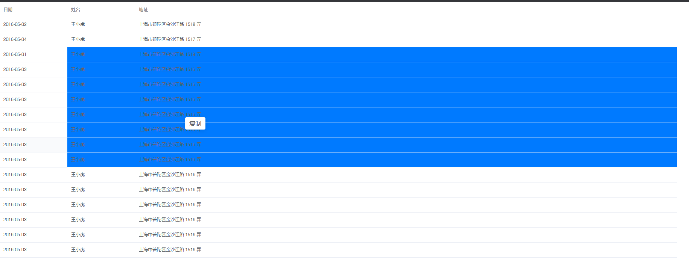

点击拖动选中，复制选中区域表格文本至剪切板

</img>

## 特性 / Features

* 点击拖动选择区域
* 一键复制或右键复制

## 使用说明

安装 cnpm i table-clipboard

# 使用

import tableClip from 'table-clipboard';

tableClip 加入到组件mixin中

# 绑定处理函数(操作触发区域)

   <table ref="clipTableContent"></table>

# 初始化传入操作区域node节点即可
this.clipInit(this.$refs['clipTableContent']);

## 鸣谢 / Thanks

本项目使用了 Vue.js 及以下第三方库：

* [ElemeFE / element](https://github.com/ElemeFE/element)
* [Inndy / vue-clipboard2](https://github.com/Inndy/vue-clipboard2)
## LICENSE

MIT